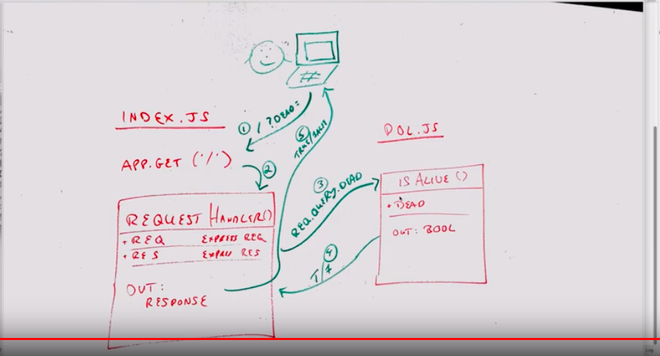

# LAB - 00

## Proof of Life server

### Author: Phil Fitch

### Links and Resources
* [submission PR](https://github.com/philfitch-401-advanced-javascript/lab-00/pull/1)
* [travis](https://travis-ci.com/philfitch-401-advanced-javascript/lab-00)
* [front-end](https://philfitch-lab-00.herokuapp.com/)

#### Documentation
* [jsdoc](https://philfitch-lab-00.herokuapp.com/docs/)

### Modules
#### `pos.js`
##### Exported Values and Methods

###### `isAlive(dead) -> boolean`
Return true/false to indicate how the server works

### Setup
#### `.env` requirements
* `PORT` - Port Number

#### Running the app

* `npm start`
* Endpoint: `/`
    * Returns a boolean
* 
endpoint: `/docs`
    * Returns JSDoc documentation pages
  
#### Tests
* Unit Tests: `npm test`
* Lint Tests: `npm run lint`

#### UML

